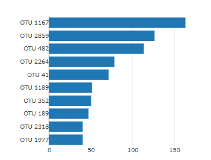
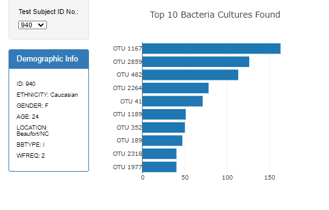
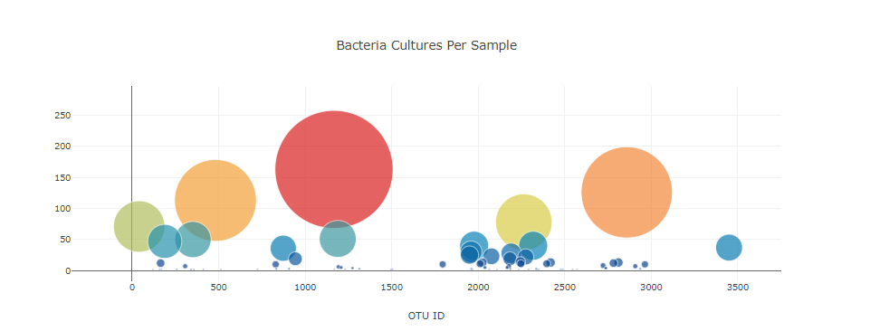
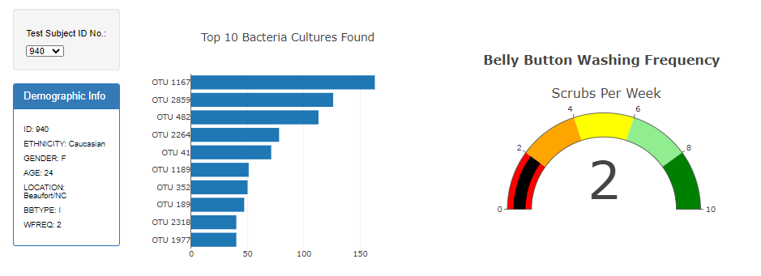
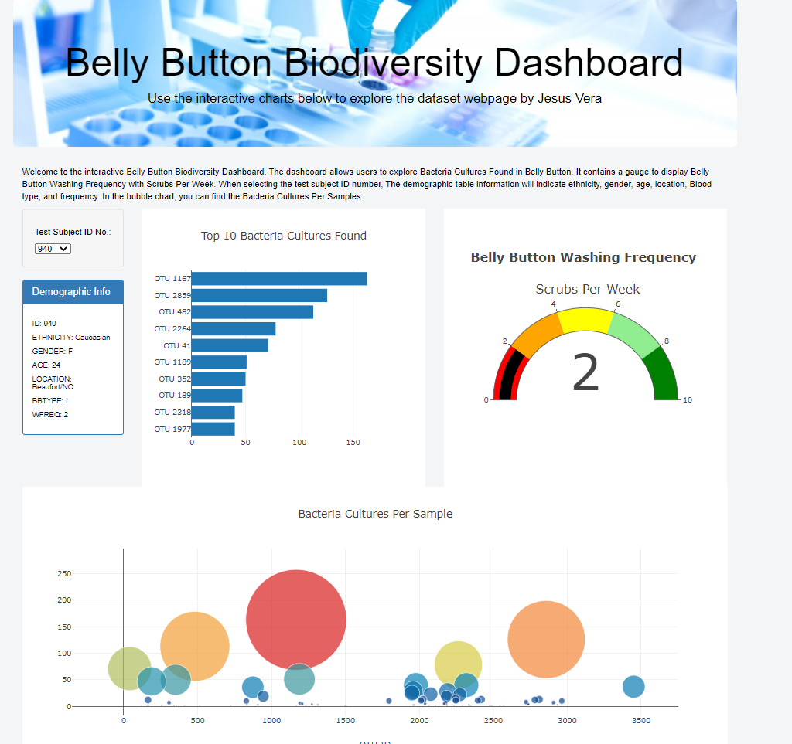

# Plotly

# Overview of Project: Explain the purpose of this analysis.
Roza has a partially completed dashboard that she needs to finish. She has a completed panel for demographic information and now needs to visualize the bacterial data for each volunteer. Specifically, her volunteers should be able to identify the top 10 bacterial species in their belly buttons. That way, if Improbable Beef identifies a species as a candidate to manufacture synthetic beef, Roza's volunteers will be able to identify whether that species is found in their navel.

What You're Creating
This new assignment consists of four technical analysis deliverables. You will submit the following:

Deliverable 1: Create a Horizontal Bar Chart
Deliverable 2: Create a Bubble Chart
Deliverable 3: Create a Gauge Chart
Deliverable 4: Customize the Dashboard

# Results: Describe support your explanation.
Deliverable 1 Instructions
Using your knowledge of JavaScript, Plotly, and D3.js, create a horizontal bar chart to display the top 10 bacterial species (OTUs) when an individual’s ID is selected from the dropdown menu on the webpage. The horizontal bar chart will display the sample_values as the values, the otu_ids as the labels, and the otu_labels as the hover text for the bars on the chart.

Deliverable 1: Create a Horizontal Bar Chart
Your bar chart should look like the following image:

After you have completed the coding requirements, your dashboard will look like this image when it loads for the first time:

Deliverable 2: Create a Bubble Chart

Deliverable 3: Create a Gauge Chart

# Summary: In a summary statement.

In this chapter, I learned about the following topics:  
Using a local server to test my project. Displaying my project onto a public server using GitHub Pages. Sharing my project with the world. I learned how to make attractive charts for users and how to make them interactive. I also learned how to filter the data and display information specific to each volunteer. 

I was able to create a Welcome to the interactive Belly Button Biodiversity Dashboard. The dashboard allows users to explore Bacteria Cultures Found in Belly Button. It contains a gauge to display Belly Button Washing Frequency with Scrubs Per Week. When selecting the test subject ID number, The demographic table information will indicate ethnicity, gender, age, location, Blood type, and frequency. In the bubble chart, you can find the Bacteria Cultures Per Samples.
Deliverable 4: Customize the Dashboard

